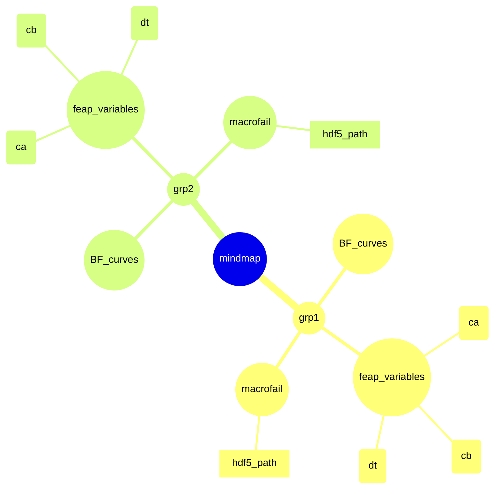
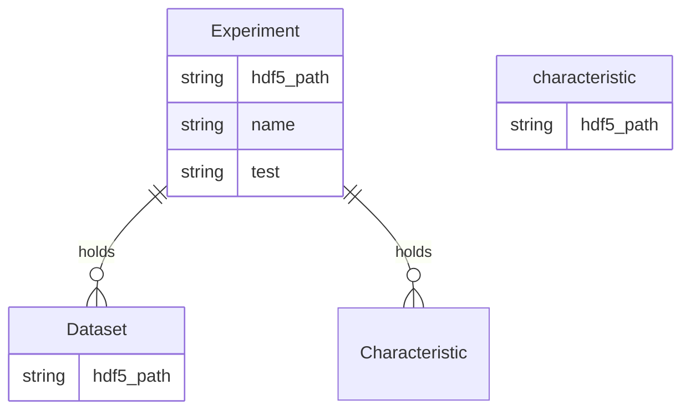

# HDF5-graph

[](https://pixi.sh)
<!-- [](https://github.tik.uni-stuttgart.de/DAE/molten/actions/workflows/pytest.yml)
[](https://github.tik.uni-stuttgart.de/DAE/molten/actions/workflows/docs.yml) -->


## What are we going for?

- circle is node
- round edges is node with neo4j datatype
- rectangle is property



### Example Cypher Queries

Return all datapoints hdf5 paths where ca=0.3
```Cypher
MATCH (d:Dataset{name:"datapoint"})-[]->(e:Experiment)-[]->(c:Dataset{name:"ca",value:0.3})
RETURN d.hdf5_path
```
Return all datapoints hdf5 paths where ca=0.3 and which were identified as the first curve
```Cypher
MATCH (d:Dataset{name:"datapoint"})-[]->(e:Experiment)-[]->(c:Dataset{name:"ca",value:0.3})
WHERE d.hdf5_path CONTAINS '\Curve_0\'
RETURN d.hdf5_path
```

### Rules:

- top groups are experiments



### H5-Example

```xml
HDF5 "data\CompleteData.h5" {
GROUP "/" {
   GROUP "202305190830" {
      GROUP "BF_curves" {
         GROUP "Curve_0" {
            GROUP "Spline" {
               ATTRIBUTE "Date" {
                  DATATYPE  H5T_STRING {
                     STRSIZE H5T_VARIABLE;
                     STRPAD H5T_STR_NULLTERM;
                     CSET H5T_CSET_UTF8;
                     CTYPE H5T_C_S1;
                  }
                  DATASPACE  SCALAR
                  DATA {
                  (0): "2024/07/01 16:42:42"
                  }
               }
               ATTRIBUTE "Info" {
                  DATATYPE  H5T_STRING {
                     STRSIZE H5T_VARIABLE;
                     STRPAD H5T_STR_NULLTERM;
                     CSET H5T_CSET_UTF8;
                     CTYPE H5T_C_S1;
                  }
                  DATASPACE  SCALAR
                  DATA {
                  (0): "Spline-Object"
                  }
               }
               ATTRIBUTE "Package" {
                  DATATYPE  H5T_STRING {
                     STRSIZE H5T_VARIABLE;
                     STRPAD H5T_STR_NULLTERM;
                     CSET H5T_CSET_UTF8;
                     CTYPE H5T_C_S1;
                  }
                  DATASPACE  SCALAR
                  DATA {
                  (0): "Spline Package by Claudius Haag"
                  }
               }
               ATTRIBUTE "Version" {
                  DATATYPE  H5T_IEEE_F64LE
                  DATASPACE  SCALAR
                  DATA {
                  (0): 0.6
                  }
               }
               DATASET "C" {
                  DATATYPE  H5T_IEEE_F64LE
                  DATASPACE  SIMPLE { ( 116, 156 ) / ( 116, 156 ) }
                  DATA {XXXXX}
               }
            }
            DATASET "Spline_Interp" {
               DATATYPE  H5T_IEEE_F64LE
               DATASPACE  SIMPLE { ( 1000, 2 ) / ( 1000, 2 ) }
               DATA {XXXX}
            }
            DATASET "datapoints" {
               DATATYPE  H5T_IEEE_F64LE
               DATASPACE  SIMPLE { ( 96, 2 ) / ( 96, 2 ) }
               DATA {
               (0,0): 5.8783e-17, -0.213193,
               }
            }
        }
        GROUP "Curve_1" {
            GROUP "Spline" {
               ATTRIBUTE "Date" {
                  DATATYPE  H5T_STRING {
                     STRSIZE H5T_VARIABLE;
                     STRPAD H5T_STR_NULLTERM;
                     CSET H5T_CSET_UTF8;
                     CTYPE H5T_C_S1;
                  }
                  DATASPACE  SCALAR
                  DATA {
                  (0): "2024/07/01 16:42:45"
                  }
               }
               ATTRIBUTE "Info" {
                  DATATYPE  H5T_STRING {
                     STRSIZE H5T_VARIABLE;
                     STRPAD H5T_STR_NULLTERM;
                     CSET H5T_CSET_UTF8;
                     CTYPE H5T_C_S1;
                  }
                  DATASPACE  SCALAR
                  DATA {
                  (0): "Spline-Object"
                  }
               }
               ATTRIBUTE "Package" {
                  DATATYPE  H5T_STRING {
                     STRSIZE H5T_VARIABLE;
                     STRPAD H5T_STR_NULLTERM;
                     CSET H5T_CSET_UTF8;
                     CTYPE H5T_C_S1;
                  }
                  DATASPACE  SCALAR
                  DATA {
                  (0): "Spline Package by Claudius Haag"
                  }
               }
               ATTRIBUTE "Version" {


```